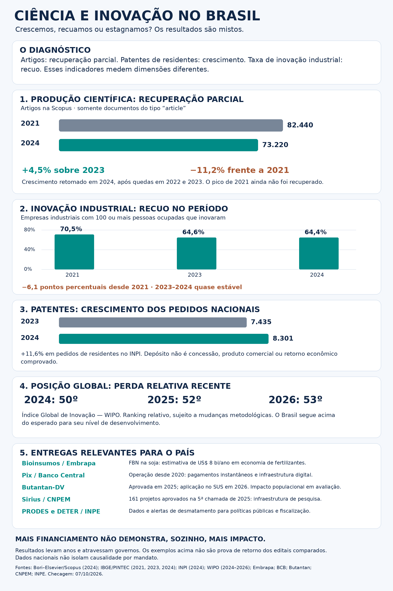
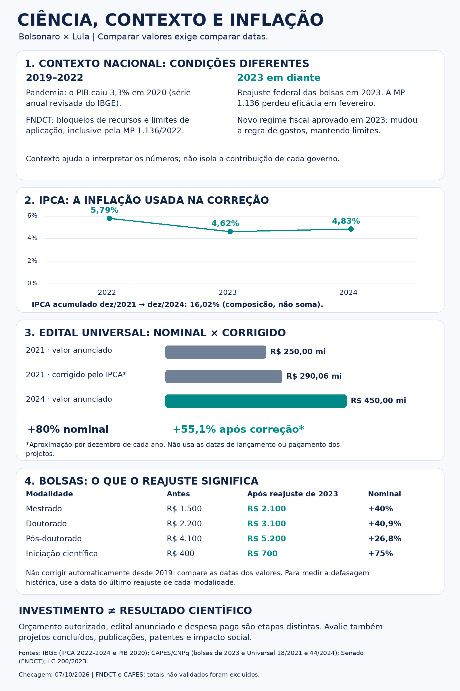

# Ciência e inovação no Brasil: evidências, contexto e resultados

Repositório de pesquisa e comunicação para Wanderley Uchôa (Deko), com dados públicos, fontes rastreáveis, metodologia, gráficos e post para LinkedIn. Data de corte: **07/10/2026**.

## Resultado principal

Recuperação parcial de artigos em 2024; crescimento dos pedidos de patentes por residentes; recuo da taxa de inovação industrial. Indicadores de períodos e universos distintos: não resumem todo o sistema nem demonstram causalidade por governo.

## Conteúdo

- [Post final](posts/linkedin.md)
- [Conclusões](docs/conclusoes.md)
- [Metodologia e cálculos](docs/metodologia.md)
- [Checagem da imagem original](docs/checagem_original.md)
- [Entregas e limites](docs/entregas_relevantes.md)
- [Bibliografia](referencias/bibliografia.md) e [fontes estruturadas](referencias/fontes.json)
- [Dados e dicionário](dados/README.md)
- [Infográfico de contexto e inflação (base64)](infograficos/ciencia-contexto-inflacao.png.base64)
- Scripts de geração e cálculo em `scripts/`.

## Reproduzir

Python 3.10+; instalar `python -m pip install -r requirements.txt`.
Executar `python scripts/calculos.py` e `python scripts/gerar_resultados.py`.
Os scripts gráficos usam fontes DejaVu Sans no Linux; ajustar caminho se necessário. Gráficos são desenhados deterministicamente com Pillow.

## Proveniência e limites

Consulta de páginas e trechos pertinentes, não leitura integral de todas as fontes ou extração dos microdados. Informações de notícias institucionais não são equivalentes a auditoria independente. Estimativa Embrapa de US$8bi tem ano-base não identificado. Fontes externas mantêm direitos próprios; PDFs de terceiros não foram republicados.

Há material anterior de financiamento para contextualização, com comparação Universal corrigida aproximada por dezembro de cada ano. Totais exatos de FNDCT e execução CAPES da imagem inicial não validados foram excluídos.

## Atualizações

Preservar versões, registrar fonte e data, não interpolar anos ausentes e regenerar gráficos após mudança de dados. Veja [histórico](CHANGELOG.md).
